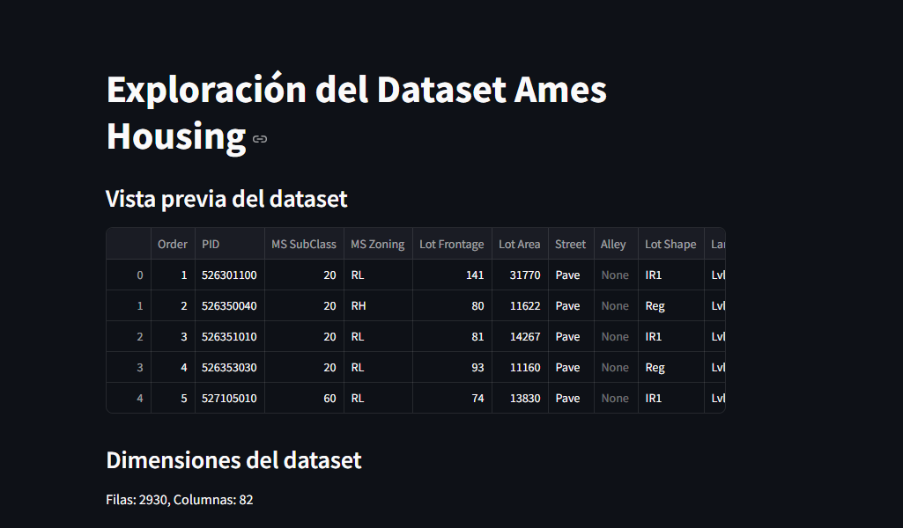
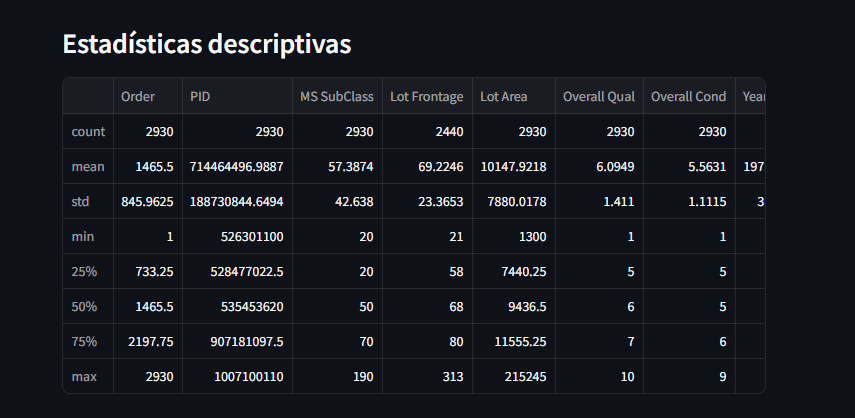
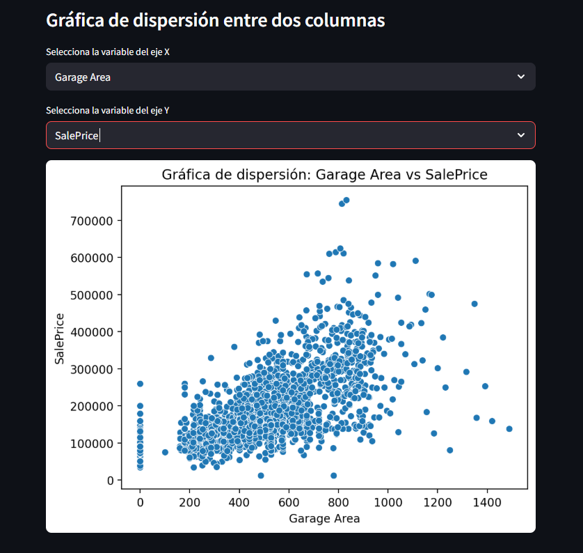
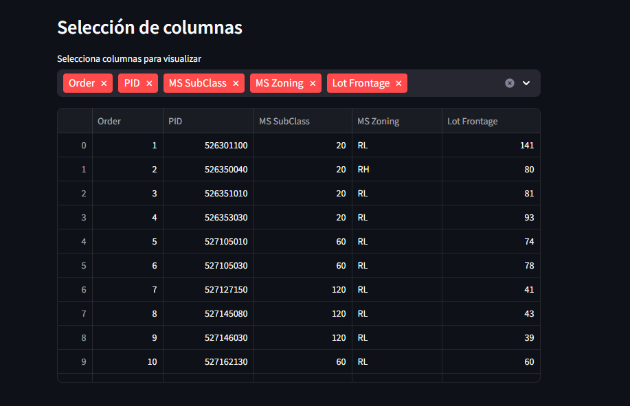
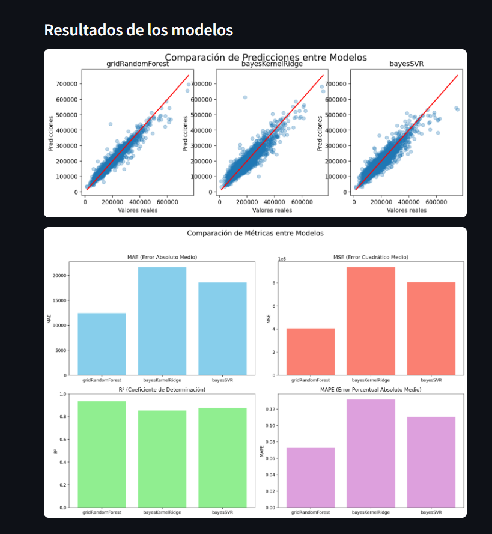

# Parcial 1 Teoría de Aprendizaje de Máquina

*Elaborado por: Juan Esteban Guevara Roncancio*

## **Notas importantes:**
1. El primer punto se encuentra adjunto a este repositorio como archivo PDF.
2. Para acceder al dashboard, debe ejecutar el código completo (toma aproximadamente 60-70 minutos). 
Al final en la penúltima celda obtendrá un link para acceder al dashboard.
3. Al ingresar **1** en el diálogo de la última celda, podrá terminar el proceso de StreamLit.
4. En el momento que se realiza el renderizado de los resultados de los modelos, este proceso se hace en tiempo real, no son las gráficas guardadas sobre los datos de entrenamiento sino una predicción sobre todo el dataset que se realiza en el momento que streamlit es activado por la llegada de una petición HTTP.

## Preview dashboard:
El dashboard generado cuenta con las siguientes vistas de forma relevante:

**Vista previa del dataframe:**

Permite visualizar los campos y valores del dataframe previo al preprocesamiento:

Junto a sus dimensiones.

**Estatísticas descriptivas:**:
Equivalente a `df.describe()`, nos entregará una descripción general de cada una de las características del dataset en términos de media, desviación estándar, valor mínimo, máximo, mediana, etc..

**Gráfica de dispersión entre dos columnas:**

De forma interactiva va a permitir relacionar dos variables graficando su dispersión a lo largo de un plano 2D. Esto nos puede dar una idea de sus correlaciones.

**Selección de columnas:**

Permite seleccionar de forma interactiva las columnas que serán visualizadas en la tabla, esto para facilitar el reconocimiento y exploración de los datos.

**Resultados de los modelos:**

Hace una visualización de los 3 modelos entrenados que tuvieron mejor desempeño durante las pruebas. Se va a evidenciar así una gráfica de dispersión donde los puntos azules son las predicciones y la línea roja son los datos reales, una gráfica más dispersa respecto a la línea nos indica que ese modelo tiene un mayor error.

Adicionalmente se cuenta con un gráfico de barras donde se puede comparar cada modelo para las siguientes métricas:

* MAE
* MSE
* MAPE
* R2

